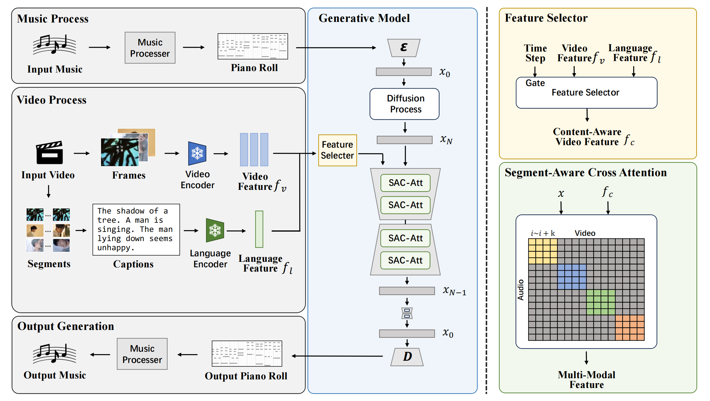

# Diff-BGM: A Diffusion Model for Video Background Music Generation

Official implementation for CVPR 2024 paper: **Diff-BGM: A Diffusion Model for Video Background Music Generation**

By Sizhe Li, Yiming Qin, Minghang Zheng, Xin Jin, Yang Liu.



- Thanks for the code structure from [diffbgm](https://github.com/aik2mlj/diffbgm/tree/sdf_prmat2c%2Bpop909)

## 1. Installation

``` shell
pip install -r requirements.txt
pip install -e diffbgm
pip isntall -e diffbgm/mir_eval
```

## 2. Training

### Preparations

1. The extracted features of the dataset POP909 can be accessed [here](https://yukisaki-my.sharepoint.com/personal/aik2_yukisaki_io/_layouts/15/onedrive.aspx?id=%2Fpersonal%2Faik2%5Fyukisaki%5Fio%2FDocuments%2FShare%2Fdiffbgm%2FPOP909%5F4%5Fbin%5Fpnt%5F8bar%2Ezip&parent=%2Fpersonal%2Faik2%5Fyukisaki%5Fio%2FDocuments%2FShare%2Fdiffbgm&ga=1). Please put it under `/data/` after extraction.

2. The extracted features of the dataset BGM909 can be accessed [here](https://drive.google.com/drive/folders/1zRNROuTxVNhJfqeyqRzPoIY60z5zLaHK?usp=sharing). Please put them under `/data/bgm909/` after extraction. We use [VideoCLIP](https://github.com/CryhanFang/CLIP2Video) to extract the video feature, use [BLIP](https://github.com/salesforce/BLIP) to gain the video caption then use [Bert-base-uncased](https://huggingface.co/google-bert/bert-base-uncased) as the language encoder and use [TransNetV2](https://github.com/soCzech/TransNetV2) to capture the shot.   
We also provide the original captions [here](https://drive.google.com/drive/folders/1q2F7jOfJ6Y0eD-hM_pbZRuP7Jnk-1r7u?usp=sharing).

3. The needed pre-trained models for training can be accessed [here](https://yukisaki-my.sharepoint.com/personal/aik2_yukisaki_io/_layouts/15/onedrive.aspx?id=%2Fpersonal%2Faik2%5Fyukisaki%5Fio%2FDocuments%2FShare%2Fdiffbgm%2Fpretrained%5Fmodels%5Ffor%5Fdiffbgm%2Ezip&parent=%2Fpersonal%2Faik2%5Fyukisaki%5Fio%2FDocuments%2FShare%2Fdiffbgm&ga=1). Please put them under `/pretrained/` after extraction.

### Commands

```shell
python diffbgm/main.py --model ldm_chd8bar --output_dir [output_dir]
```

## 3. Inference

Please use the following message to generate music for videos in BGM909.

```shell
python diffbgm/inference_sdf.py --model_dir=[model_dir] --uncond_scale=5.
```

## 4. Test

To reproduce the metrics in our original paper, please refer to `/diffbgm/test.ipynb`.

| Backbone | PCHE | GPS | SI | P@20 | Weights|
| -------- | ---- | --- | -- | ---- | ------ | 
| Diff-BGM (original) | 2.840 | 0.601 | 0.521 | 46.79 | [weights](https://drive.google.com/file/d/1QzmJjNsSDQKpAEATD3XbSZalI1AULx1O/view?usp=sharing) |
| Diff-BGM (only visual) | 2.835 | 0.514 | 0.396 | 46.26 | [weights](https://drive.google.com/file/d/1mtX24RLViblmSBbwx1WPqzQnSLnat5i3/view?usp=sharing) |
| Diff-BGM (w/o SAC-Att) | 2.721 | 0.789 | 0.523 | 43.57 | [weights](https://drive.google.com/file/d/1q39Azhty0lznhfdVMWxplUkYN7CE0VmA/view?usp=sharing) |

We provide the generation results [here](https://drive.google.com/drive/folders/1kYQLAmw8-zyBx43RW7aUSE8VXcFDxkez?usp=sharing).

## 5. Make a Demo by yourself!

After generating a piece of music, you can use the following commands to generate a video.

```shell
sudo apt-get install ffmpeg fluidsynth
fluidsynth -i <SoundFont file> <midi file> -F <wav file>
ffmpeg -i <wav file> -b:a <bit rate> <mp3 file>
ffmpeg -i <video file> -i <mp3 file> -c:a aac -map 0:v:0 -map 1:a:0 <output file>
```

See our [demo](./video.mp4)!

<video width="320" height="240" controls>
  <source src="./video.mp4" type="video/mp4">
  
</video>
